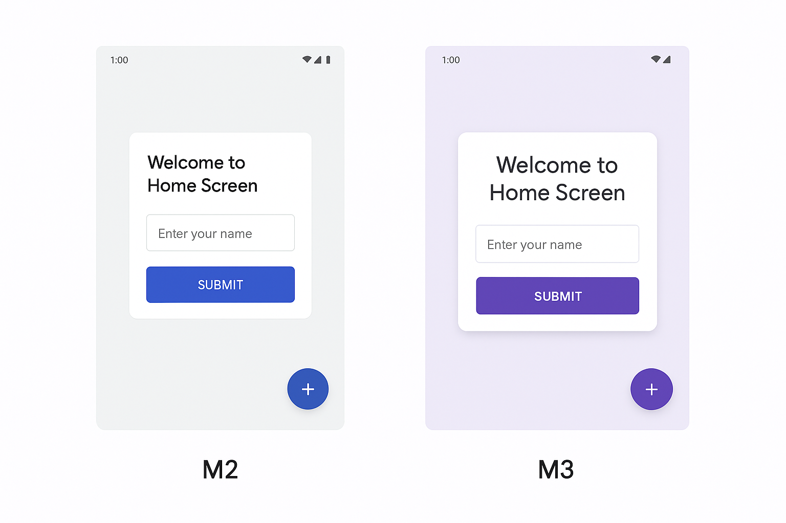

# 📱 Mapping Material 2 → Material 3 (Android)

---

## 1. 🎨 Theme & Parent
| **Material 2** | **Material 3** |
|:----------------|:---------------|
| `Theme.MaterialComponents.DayNight.*` | `Theme.Material3.DayNight.*` |
| `Theme.MaterialComponents.Light.*` | `Theme.Material3.Light.*` |
| `ThemeOverlay.MaterialComponents.*` | `ThemeOverlay.Material3.*` |

---

## 2. 🔘 Buttons
| **M2** | **M3** |
|:-------|:-------|
| `Widget.MaterialComponents.Button` | `Widget.Material3.Button.Filled` |
| `Widget.MaterialComponents.Button.OutlinedButton` | `Widget.Material3.Button.Outlined` |
| `Widget.MaterialComponents.Button.TextButton` | `Widget.Material3.Button.Text` |
| *(Không có)* | `Widget.Material3.Button.Elevated` |
| *(Không có)* | `Widget.Material3.Button.Tonal` |

---

## 3. 📝 Text Field
| **M2** | **M3** |
|:-------|:-------|
| `Widget.MaterialComponents.TextInputLayout.OutlinedBox` | `Widget.Material3.TextInputLayout.OutlinedBox` |
| `Widget.MaterialComponents.TextInputLayout.FilledBox` | `Widget.Material3.TextInputLayout.FilledBox` |
| `Widget.MaterialComponents.TextInputEditText.OutlinedBox` | `Widget.Material3.TextInputEditText.OutlinedBox` |
| `Widget.MaterialComponents.TextInputEditText.FilledBox` | `Widget.Material3.TextInputEditText.FilledBox` |

---

## 4. 🪂 Floating Action Button (FAB)
| **M2** | **M3** |
|:-------|:-------|
| `Widget.MaterialComponents.FloatingActionButton` | `Widget.Material3.FloatingActionButton` |
| *(Không có)* | `Widget.Material3.FloatingActionButton.Small` |
| *(Không có)* | `Widget.Material3.FloatingActionButton.Large` |
| *(Không có)* | `Widget.Material3.FloatingActionButton.Surface` |

---

## 5. 🃏 Card
| **M2** | **M3** |
|:-------|:-------|
| `Widget.MaterialComponents.CardView` | `Widget.Material3.CardView.Elevated` |
| *(Không có)* | `Widget.Material3.CardView.Outlined` |
| *(Không có)* | `Widget.Material3.CardView.Filled` |

---

## 6. 🧭 Navigation
| **M2** | **M3** |
|:-------|:-------|
| `Widget.MaterialComponents.BottomNavigationView` | `Widget.Material3.NavigationBarView` |
| `Widget.MaterialComponents.TabLayout` | `Widget.Material3.TabLayout` |
| *(Không có)* | `Widget.Material3.NavigationRailView` |

---

## 7. 🏷 Chips
| **M2** | **M3** |
|:-------|:-------|
| `Widget.MaterialComponents.Chip` | `Widget.Material3.Chip.Assist` |
| *(Không có)* | `Widget.Material3.Chip.Filter` |
| *(Không có)* | `Widget.Material3.Chip.Input` |
| *(Không có)* | `Widget.Material3.Chip.Suggestion` |

---

## 8. 🎚 Slider / Switch
| **M2** | **M3** |
|:-------|:-------|
| `Widget.MaterialComponents.Slider` | `Widget.Material3.Slider` |
| `Widget.MaterialComponents.SwitchMaterial` | `Widget.Material3.Switch` |

---

## 9. ✍ Typography
| **M2 (TextAppearance)** | **M3 (TextAppearance)** |
|:------------------------|:------------------------|
| `TextAppearance.MaterialComponents.Headline1` | `TextAppearance.Material3.DisplayLarge` |
| `TextAppearance.MaterialComponents.Headline2` | `TextAppearance.Material3.DisplayMedium` |
| `TextAppearance.MaterialComponents.Headline3` | `TextAppearance.Material3.DisplaySmall` |
| `TextAppearance.MaterialComponents.Headline4` | `TextAppearance.Material3.HeadlineLarge` |
| `TextAppearance.MaterialComponents.Headline5` | `TextAppearance.Material3.HeadlineMedium` |
| `TextAppearance.MaterialComponents.Headline6` | `TextAppearance.Material3.HeadlineSmall` |
| `TextAppearance.MaterialComponents.Subtitle1` | `TextAppearance.Material3.TitleLarge` |
| `TextAppearance.MaterialComponents.Subtitle2` | `TextAppearance.Material3.TitleMedium` |
| `TextAppearance.MaterialComponents.Body1` | `TextAppearance.Material3.BodyLarge` |
| `TextAppearance.MaterialComponents.Body2` | `TextAppearance.Material3.BodyMedium` |
| `TextAppearance.MaterialComponents.Button` | `TextAppearance.Material3.LabelLarge` |
| `TextAppearance.MaterialComponents.Caption` | `TextAppearance.Material3.BodySmall` |
| `TextAppearance.MaterialComponents.Overline` | `TextAppearance.Material3.LabelSmall` |

---

## 10. 🖥 Edge-to-Edge & Dynamic Colors
| **M2** | **M3** |
|:-------|:-------|
| *(Không có)* | `EdgeToEdge.enable(activity)` |
| *(Không có)* | `DynamicColors.applyToActivitiesIfAvailable(Application, DynamicColorsOptions)` |

---

## 11. 🌈 Colors
| **M2 Colors** | **M3 Colors** |
|:--------------|:--------------|
| `colorPrimary` | `colorPrimary` (tone 40 của palette) |
| `colorPrimaryVariant` | `colorPrimaryContainer` |
| `colorSecondary` | `colorSecondary` |
| `colorSecondaryVariant` | `colorSecondaryContainer` |
| `colorSurface` | `surface` (tone 98 light / 6 dark) |
| `colorBackground` | `background` |
| `colorError` | `error` |
| *(Không có)* | `tertiary`, `onTertiary`, `tertiaryContainer` |
| *(Không có)* | `outline`, `surfaceVariant` |

---

💡 **Tips khi migrate:**
- Đổi **parent theme** sang `Theme.Material3.*`
- Update **colors** theo `md_theme_light_*` và `md_theme_dark_*`
- Dùng **typography** mới
- Gọi `DynamicColors.applyToActivitiesIfAvailable()` để kích hoạt Material You 